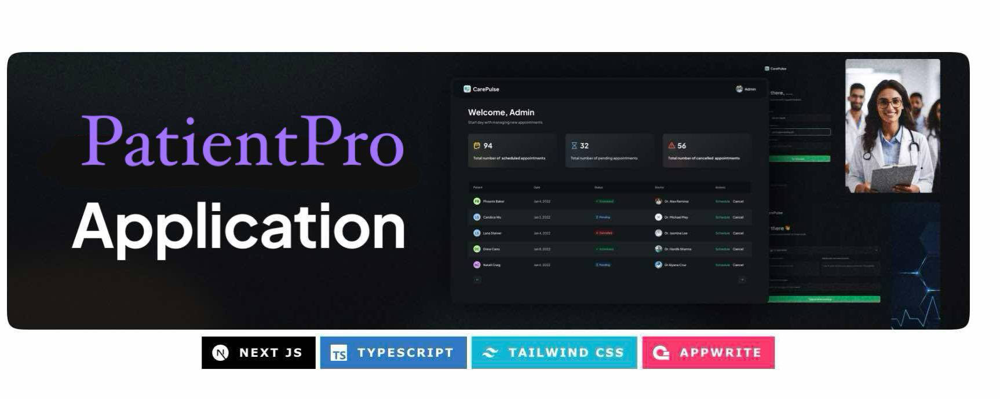

# 🩺 PatientPro Application

PatientPro is a complete healthcare management platform built with Next.js, Appwrite, and Tailwind CSS. It allows patients to register, book appointments, and receive SMS confirmations. On the admin side, it provides a powerful dashboard to view, confirm, cancel, and manage all appointments securely and efficiently.



---

## **Why This Project Matters**

Modern healthcare systems require seamless digital interaction between patients and providers. Scheduling inefficiencies, communication delays, and disconnected admin workflows lead to frustration and lost productivity. PatientPro solves these issues by integrating patient registration, secure backend management, real-time scheduling, and communication — all in one platform.

This project also reflects my ability to design scalable, full-stack applications using a modern tech stack, combining performance, design, and user experience.

---

## **How I Came Up With This Idea**

I’ve personally experienced the frustration of dealing with slow, disorganized healthcare systems — from missed appointments to unclear communication. As a Computer Science student, I’ve always wanted to apply my skills to bring real change to people’s lives. That’s what motivated me to build **PatientPro** — a tool that bridges the gap between patients and providers through smart, efficient technology. Contributing to the healthcare system, even in a small way, felt like the right step toward something meaningful.

---

## **Tech Stack**

**Frontend**: Next.js, TypeScript, Tailwind CSS, ShadCN  
**Backend**: Appwrite (Backend-as-a-Service)  
**Authentication**: Appwrite Auth  
**SMS Notifications**: Twilio  
**Storage**: Appwrite Storage  
**Monitoring**: Sentry  
**Deployment**: Vercel  
**Design System**: Tailwind CSS, ShadCN UI Components

---

## **🔋 Features**

👉 **Register as a Patient**  
Users can sign up and create a personal profile using Appwrite's authentication system and Next.js API integration.

👉 **Book a New Appointment with Doctor**  
Patients can schedule appointments dynamically using Appwrite's database and React forms.

👉 **Manage Appointments on Admin Side**  
Built with a custom dashboard using Tailwind CSS, React, and Appwrite’s database querying tools.

👉 **Confirm/Schedule Appointment from Admin Side**  
Admins can update appointment status via Appwrite functions, connected to a responsive UI.

👉 **Cancel Appointment from Admin Side**  
Admin-side appointment deletion is enabled through Appwrite’s document management and real-time updates.

👉 **Send SMS on Appointment Confirmation**  
Twilio is integrated with backend logic to send confirmation texts when appointments are booked or confirmed.

👉 **Complete Responsiveness**  
Built with Tailwind CSS and tested on all device breakpoints for smooth performance across phones, tablets, and desktops.

👉 **File Upload Using Appwrite Storage**  
Patients or admins can upload documents securely using Appwrite’s built-in storage services.

👉 **Manage and Track Application Performance Using Sentry**  
Errors and performance metrics are captured using the Sentry SDK for Next.js, providing full visibility into production issues.

...and many more, including modular architecture, reusable UI components, and strong typing via TypeScript.

---

## **Getting Started 🚀**

### 1. Clone the Repository

```bash
git clone https://github.com/tasnimezaz/PatientPro.git
cd PatientPro
